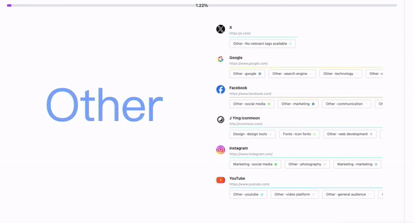

<a name="readme-top"></a>

<div align="center">

<h1>Bookmarks AI</h1>
    </div>


⚡ **Bookmarks AI** is a tool that uses AI to organize and record your bookmarks. 




## Project Background

1. Messy bookmarks? Struggle is real!
2. too many websites to remember and find later!
3. chat ui and Chrome history are separate, and it's a hassle to toggle between them, I hope AI can know what website I looked at a minute ago。
4. Integrating your browser history, ensuring your data is yours alone, and creating a personalized AI just for you.


<strong>If you also face these challenges:</strong>
<br/>
a tool is required to organize bookmarks, keep track of daily websites, and provide easy access to desired sites


## How to Works

1. Obtain your bookmark list through a plugin.
2. Use AI to analyze and create an outline, establishing a new directory structure.

3. For each bookmark, perform the following operations:
   a. Use AI analysis to add tags to the bookmark.
   b. Use AI analysis to categorize the bookmark.

This process continues until all bookmarks are organized.

4. Synchronize the organized bookmark list to your browser through the plugin.

5. Display: Use beautiful charts to show various information analyzed from the bookmarks.

This information is known only to you and won't be leaked. In the future, you can feed it to your own AI, making the AI understand you better, rather than being generic.

## [How to Use ](https://bookmarks-ai.vercel.app/extension)

1. Install the plugin
2. Fill in your key
3. Click run

## Roadmap

1. Analyze daily browsing history and provide a daily reading report.
2. Query function to quickly find the website you want.
3. Data export, allowing export in Q&A format for easy model training.

## Development Guide

1. The project uses the Plasmo framework for rapid Chrome extension development.
2. Uses Next.js for frontend development.
3. Tailwind CSS and Shadcn as CSS frameworks.
4. Langchain for developing agents.
5. Deployed on Vercel.

Local development:

```bash
pnpm install

# Run frontend
npm run dev:next
# Run plugin
npm run dev:plasmo
```
